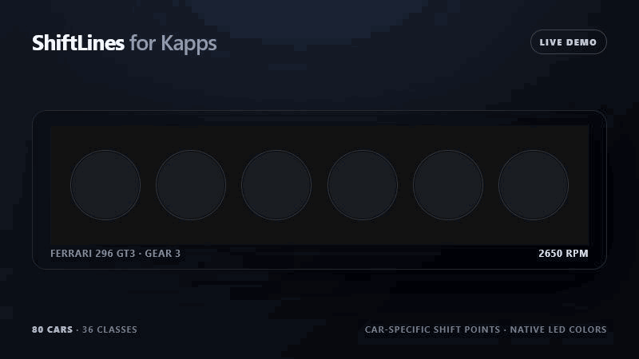

# ShiftLines for Kapps

Native Kapps Custom Overlay with car-specific iRacing shift lights. It uses the
same open Lovely Car Data project referenced by ATSR-Hub EVO: individual RPM
thresholds for every LED and every gear, native LED colors/count, and the
car-specific redline blink interval.

No separate server, SimHub, or terminal window is required. Kapps serves the
files and supplies live iRacing telemetry through its WebSocket.

## Preview



## Supported cars

ShiftLines bundles every iRacing profile currently published by the same Lovely
Car Data database used by ATSR-Hub EVO: 80 cars across 36 classes.

This includes all 12 published GT3 profiles, both LMP2 profiles (Dallara P217
and HPD ARX-01C), the Ligier JS P320 LMP3, every GTP, plus GT4, GTE, LMP1, TCR,
formula, stock car, touring car, and other published iRacing profiles.

Cars added upstream can be checked or imported with:

```powershell
npm run check:data
npm run sync:data
```

The sync script reads the current iRacing manifest directly from
`Lovely-Sim-Racing/lovely-car-data` and validates every profile before replacing
the bundled database.

## Install

1. Download `ShiftLines-Setup-v1.1.0.exe` from the latest GitHub Release and
   run it once. No extraction or terminal is required.
2. Start Kapps **as administrator** once.
3. In `App -> Settings -> App Folder`, select `Documents\iRacing\CustomApps` and
   click `Save`.
4. In `Racing Overlay`, choose `Add Custom Overlay`:

   ```text
   Name: ShiftLines
   URL:  http://127.0.0.1:8182/ShiftLines/
   ```

After Kapps creates its folder link, it can be started normally.

For a manual source checkout installation, run `Install-Kapps-App.cmd`.

## Test without iRacing

Open this URL while Kapps is running:

```text
http://127.0.0.1:8182/ShiftLines/?demo=1&debug=1
```

Choose any bundled iRacing `carId` with `car=`. Examples include
`porsche963gtp`, `ferrari296gt3`, `dallarap217`, and `ligierjsp320`.

Example:

```text
http://127.0.0.1:8182/ShiftLines/?demo=1&debug=1&car=ferrari296gt3
```

Add `?debug=1` to the live URL to display the detected car, RPM, gear, and data
source. If a car does not yet exist in the bundled database, ShiftLines falls
back to iRacing's `PlayerCarSLFirstRPM`, `PlayerCarSLShiftRPM`,
`PlayerCarSLLastRPM`, and `PlayerCarSLBlinkRPM` values.

The LED bar scales proportionally to the largest size that fits the current
Kapps layer bounds. Resize the layer freely in either direction; LED diameter,
spacing, padding, and glow scale together.

Kapps intentionally shades a focused layer while it is being moved or resized.
With `Open layers transparent` enabled, that editing shade disappears as soon
as focus returns to iRacing; it is not drawn by ShiftLines.

## Development

```powershell
npm test
.\scripts\Build-Installer.ps1
```

Node.js is only needed for tests, not to run the overlay.
